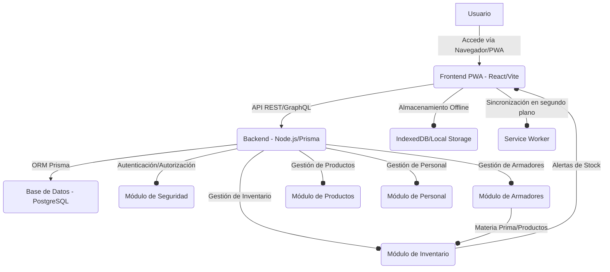

# Documento de Diseño de Arquitectura (ADD) para ZAP PWA

## 1. Introducción

Este documento describe la arquitectura de alto nivel de la PWA de ZAP, incluyendo los componentes principales, sus interacciones y las decisiones tecnológicas clave.

## 2. Visión General de la Arquitectura

La aplicación seguirá una arquitectura de cliente-servidor, con un frontend PWA (React) y un backend (Node.js) que interactúan con una base de datos PostgreSQL. Se hará un énfasis particular en la funcionalidad offline y la sincronización de datos.

## 3. Componentes Principales

### 3.1. Frontend (PWA - React/Vite)
-   **Tecnología:** React con Vite para un desarrollo rápido y optimizado.
-   **Responsabilidades:**
    -   Renderizado de la interfaz de usuario.
    -   Gestión del estado de la aplicación.
    -   Interacción con el backend a través de APIs.
    -   Almacenamiento de datos offline (IndexedDB/Local Storage).
    -   Sincronización de datos en segundo plano mediante Service Worker.
    -   Manejo de la lógica de UI para la gestión de armadores, productos, inventario y personal.
-   **Características PWA:** Manifiesto web, Service Worker para caching y sincronización.

### 3.2. Backend (Node.js/Prisma)
-   **Tecnología:** Node.js para el servidor, con un framework como Express.js o NestJS para la API REST. Prisma como ORM para la interacción con la base de datos.
-   **Responsabilidades:**
    -   Exposición de APIs RESTful para todas las operaciones CRUD.
    -   Lógica de negocio para la gestión de armadores (envíos, recepciones, control de faltantes, cálculo de producción).
    -   Lógica de negocio para la gestión de inventario (materia prima y productos terminados).
    -   Lógica de negocio para la gestión de productos y personal.
    -   Autenticación y autorización de usuarios.
    -   Validación de datos.
    -   Manejo de errores y logging.

### 3.3. Base de Datos (PostgreSQL)
-   **Tecnología:** PostgreSQL, una base de datos relacional robusta y escalable.
-   **Responsabilidades:**
    -   Almacenamiento persistente de todos los datos de la aplicación (armadores, productos, inventario, usuarios, movimientos).
    -   Asegurar la integridad y consistencia de los datos.
-   **Esquema:** Definido y gestionado a través de Prisma (`schema.prisma`).

### 3.4. Módulo de Seguridad
-   **Tecnología:** JSON Web Tokens (JWT) para autenticación, bcrypt para hashing de contraseñas.
-   **Responsabilidades:**
    -   Autenticación de usuarios internos.
    -   Autorización basada en roles para controlar el acceso a funcionalidades y datos.
    -   Protección de rutas de API.

### 3.5. Módulo de Armadores
-   **Responsabilidades:**
    -   Gestión de la información de los armadores.
    -   Registro y seguimiento de la materia prima enviada a los armadores.
    -   Registro y verificación de los productos terminados recibidos de los armadores.
    -   Cálculo de la producción por armador.
    -   Generación de alertas por faltantes.

### 3.6. Módulo de Inventario
-   **Responsabilidades:**
    -   Gestión del stock de materia prima y productos terminados.
    -   Registro de todos los movimientos de entrada y salida.
    -   Generación de alertas de stock bajo.

## 4. Flujos de Datos Clave

### 4.1. Sincronización Offline
1.  Usuario realiza una operación (CRUD) offline en el Frontend.
2.  Los datos se almacenan en IndexedDB localmente.
3.  El Service Worker detecta la conexión a internet.
4.  El Service Worker envía los datos pendientes al Backend.
5.  El Backend procesa los datos y los guarda en PostgreSQL.
6.  El Backend responde al Service Worker, que actualiza el estado local.

### 4.2. Control de Armadores
1.  Usuario registra envío de materia prima a un armador (Frontend -> Backend -> DB).
2.  Usuario registra recepción de productos terminados de un armador (Frontend -> Backend -> DB).
3.  El Backend compara los registros de envío y recepción, actualiza el stock y genera alertas si hay faltantes.
4.  El Backend calcula la producción del armador para pagos.

## 5. Consideraciones de Despliegue

-   **Entorno Local:** Docker Compose para levantar el frontend, backend y base de datos.
-   **Producción:** Google Cloud (Cloud Run para frontend y backend, Cloud SQL para PostgreSQL).

## 6. Seguridad

-   Uso de HTTPS.
-   Validación de entrada en el backend.
-   Protección contra ataques comunes (SQL Injection, XSS, CSRF).
-   Autenticación y autorización robustas.

## 7. Escalabilidad

-   La arquitectura de microservicios (Cloud Run) permite escalar el frontend y el backend de forma independiente.
-   PostgreSQL es escalable vertical y horizontalmente.